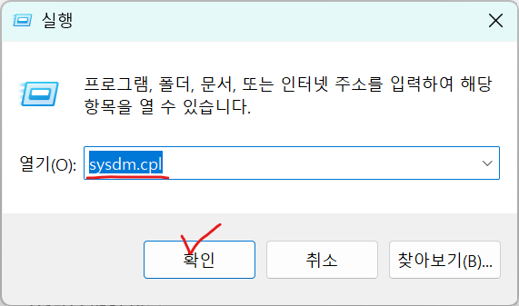
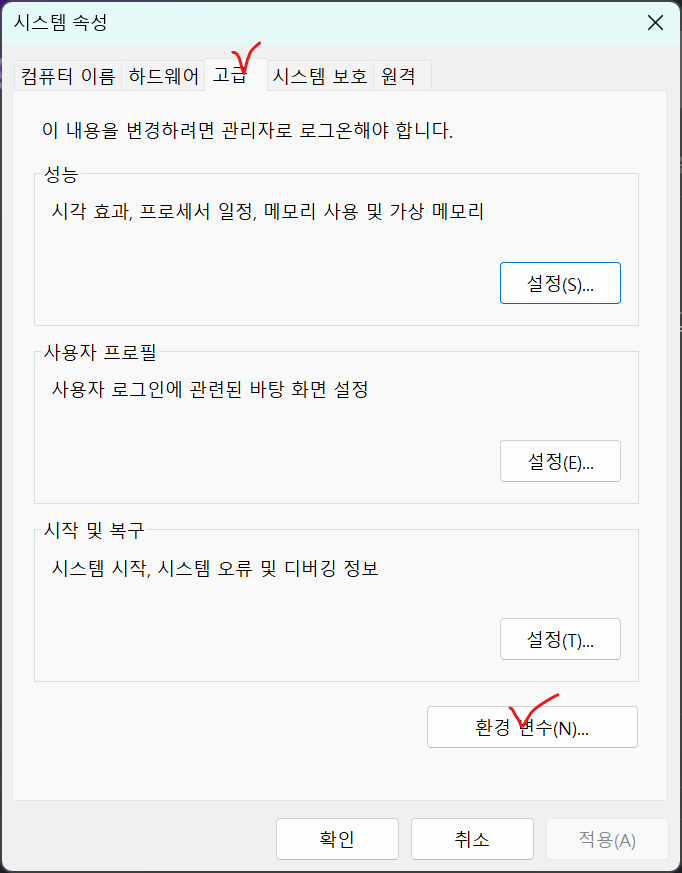
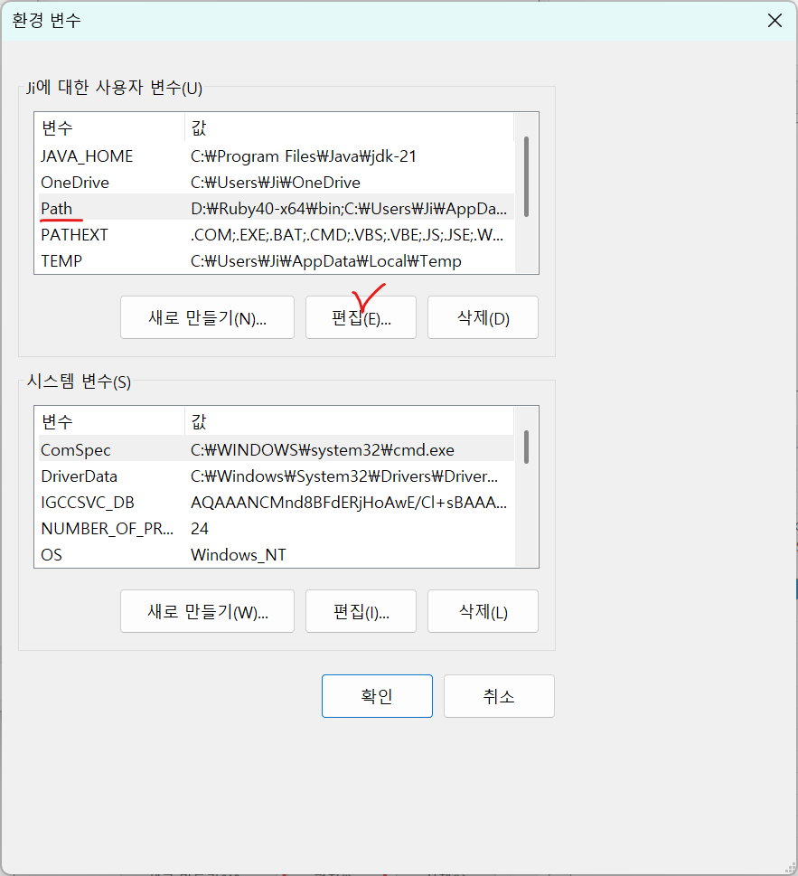
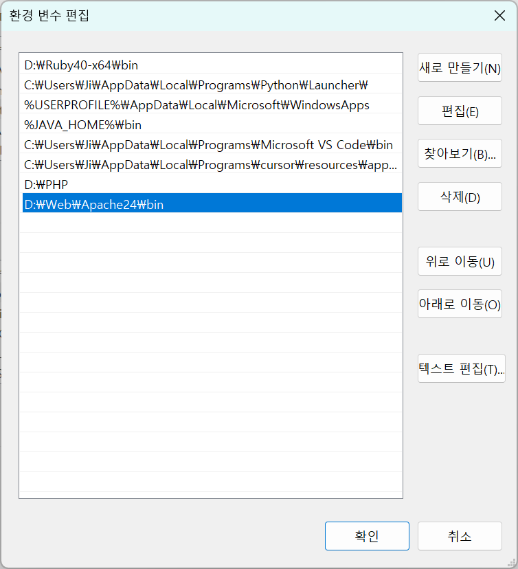
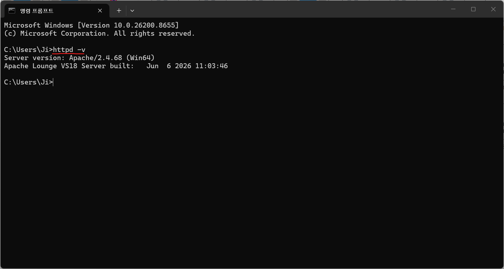
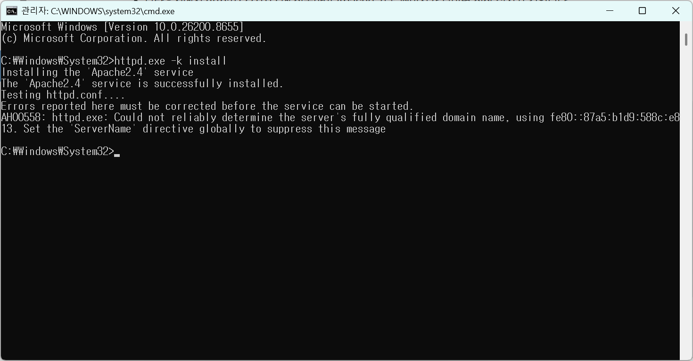

### 환경 변수 추가

window + R 으로 실행창 에서 systdm.cpl 입력

고급 > 환경 변수 들어가기

사용자 변수 Path 편집

새로 만들기로 설치한 경로에 맞는 Apache24\bin 추가

cmd에 httpd -v 로 버전을 띄어 정상적으로 들어갔는지 확인 할 수 있다.

### 아파치 서비스 등록

httpd -k install 로 서비스 성공적으로 등록된 모습

에러코드는 추후에 ServerName을 수정하면 된다.

### 아파치 실행

window + R 에서 cmd 를 ctrl shift enter로 진입(관리자 권한) httpd -k start

### 아파치 종료

window + R 에서 cmd 를 ctrl shift enter로 진입(관리자 권한) httpd -k stop

### 아파치 실행 상태 확인

window + R 에서
 services.msc
 입력
 apache 상태 실행이 떠 있는지 확인