### 다운로드

윈도우용 아파치 사이트
https://www.apachelounge.com/download/

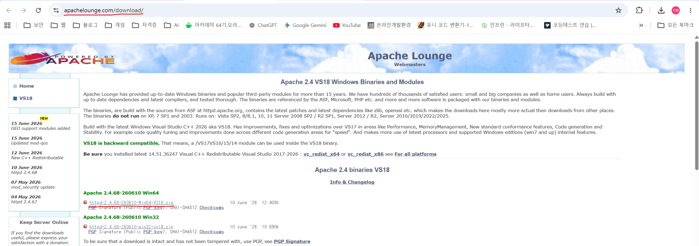

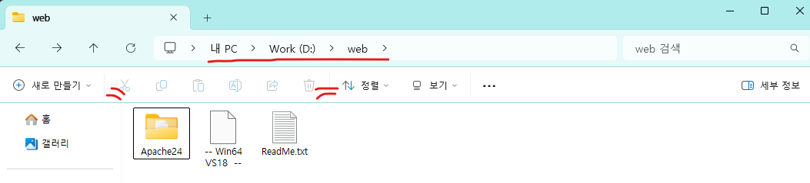

경로는 D:\web 에 저장했습니다.

### 리슨 서버 설정

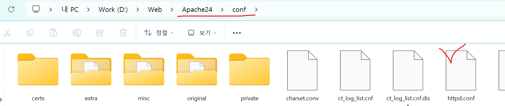

Apache24\conf 에 있는 httpd.conf 파일을 열어줍니다. 

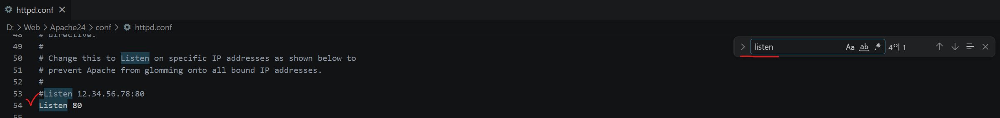

VS Code를 통해 Listen 단어를 찾고 서버를 실행할 포트를 확인합니다.

### 웹 서버 실행하기

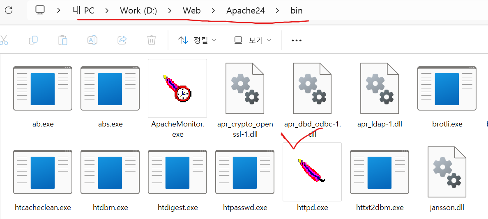

### ! 실행 실패 cmd 창이 뜨고 사라진다.
왜일까?
추측. 포트를 누가 쓰고 있나?

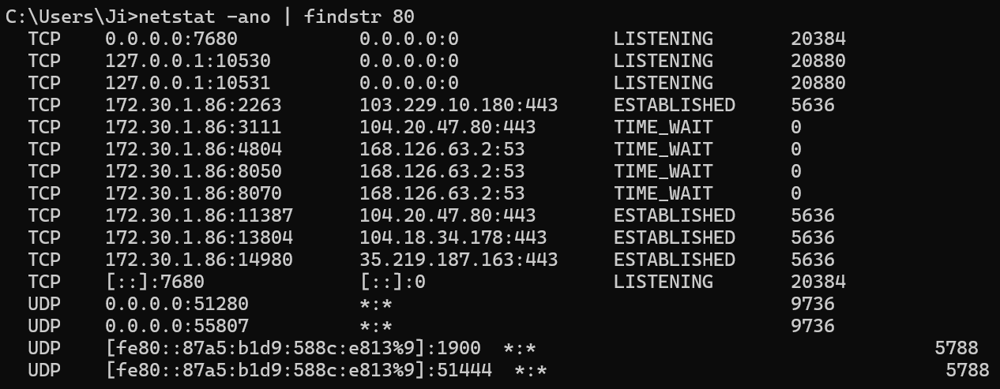
cmd 에 80을 검색  
뜨지만 사용 하고 있다면 :80으로 나와야 한다.

에러를 찾기 위해 cmd에서 실행

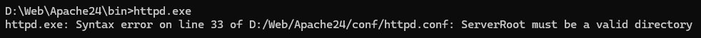
httpd.exe: Syntax error on line 33 of D:/Web/Apache24/conf/httpd.conf: ServerRoot must be a valid directory

33줄에서 에러가 뜬다고 나와있다.

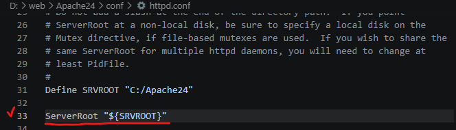
SRVROOT는 C:/Apache24 으로 경로가 틀려버린 경우이다.
보통은 C:/로 저장하는 경우가 많기 때문에 임의로 저장한 경우 수정해 줘야 한다.

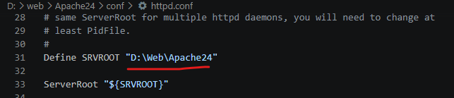
경로를 수정해 준다

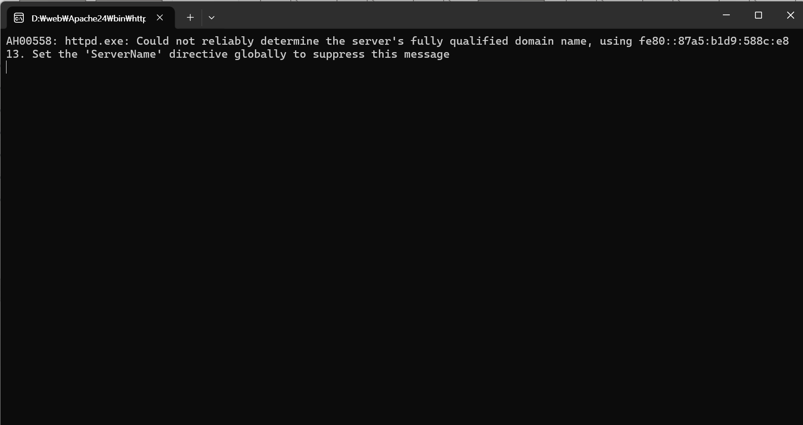

cmd 창이 뜨고 서버가 돌아가는 걸 확인 할 수 있다.  

이제 웹 브라우저로 http://localhost:80 들어가기

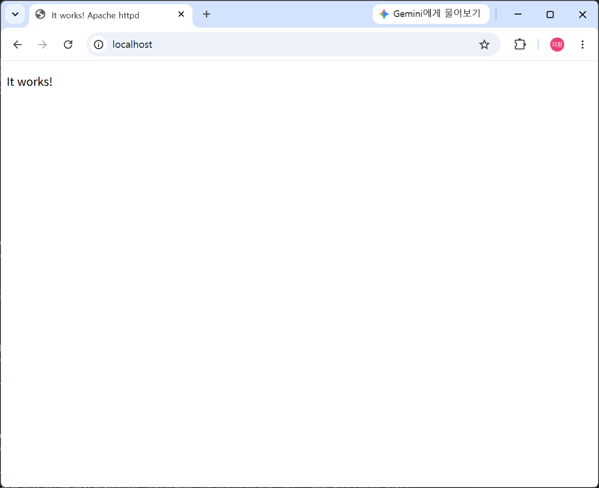

작동 되는 모습

### 작동하는 파일 확인하기

이제 실행 되는 파일을 알아보자.

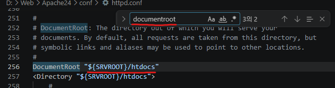

DocumentRoot 에서 실행 되고 있는 파일 경로를 볼수 있다.

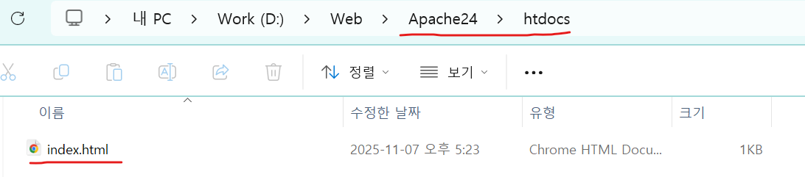

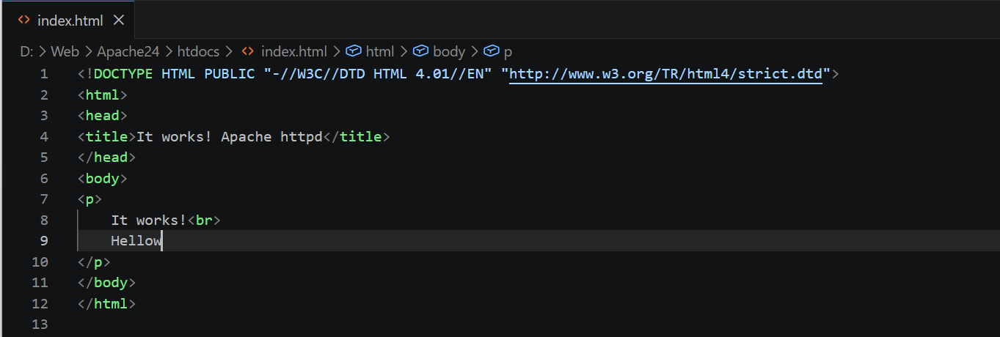

약간 수정하여 반응을 살핀다.  
위와 동일하게 http.exe 실행 웹 브라우저로 http://localhost:80 들어가면..

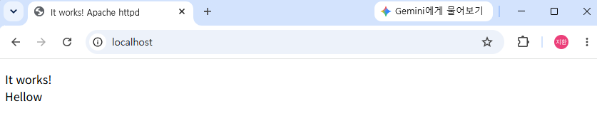

수정된 모습을 볼 수 있다. 

! 처음에는 수정 안된 모습이 보일 수 있지만 새로고침을 한다면 정상적으로 수정된 모습을 볼 수 있다.

그 외에 대표적인 환경설정 변수

## 대표적인 환경설정 변수

Listen: 웹 서버가 수신 대기하는 포트를 지정합니다. 기본적으로 80번 포트를 사용하지만, 보안을 위해 다른 포트로 변경할 수도 있습니다.

ServerRoot: 서버의 루트 디렉토리를 설정합니다. 이 디렉토리는 Apache 관련 파일의 위치를 지정합니다.

DocumentRoot: 웹 서버에서 서비스되는 파일의 기본 디렉토리를 설정합니다. 클라이언트가 접근할 수 있는 파일은 이 디렉토리 아래에 있어야 합니다.

DirectoryIndex: 디렉토리에 접근할 때 사용할 기본 문서를 지정합니다. 예를 들어, "index.html" 또는 "index.php"와 같은 파일이 될 수 있습니다.

ErrorLog: 오류 로그 파일의 경로를 지정합니다. 웹 서버에서 발생하는 오류에 대한 로그는 이 파일에 기록됩니다.

LogLevel: 로그 메시지의 상세도를 지정합니다. 이를 통해 웹 서버의 로그를 얼마나 상세하게 기록할지 결정할 수 있습니다.

ServerName: 가상 호스트를 설정할 때 사용되는 서버의 기본 도메인 이름을 지정합니다.

Directory: 특정 디렉토리에 대한 설정을 지정합니다. 인증, 액세스 제어 및 기타 디렉토리 관련 설정을 포함할 수 있습니다.

VirtualHost: 가상 호스트를 정의하고 해당 호스트에 대한 설정을 지정합니다. 이를 통해 하나의 서버에서 여러 개의 독립적인 웹 사이트를 호스팅할 수 있습니다.
[출처] 왕초보도 따라하는 윈도우에 아파치(Apache) 웹서버 설치 따라하기|작성자 개발자준생

### 참고 출처

출처 : https://blog.naver.com/cjs0308cjs/223370079814 
출처 : https://ecolumbus.tistory.com/147