### 다운로드


<!-- 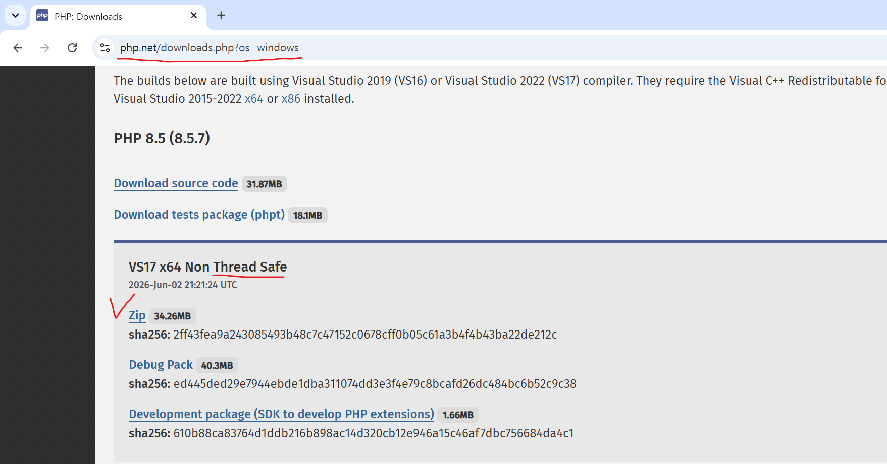 -->
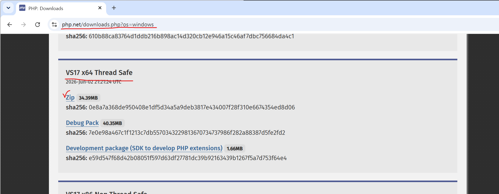

```text

```

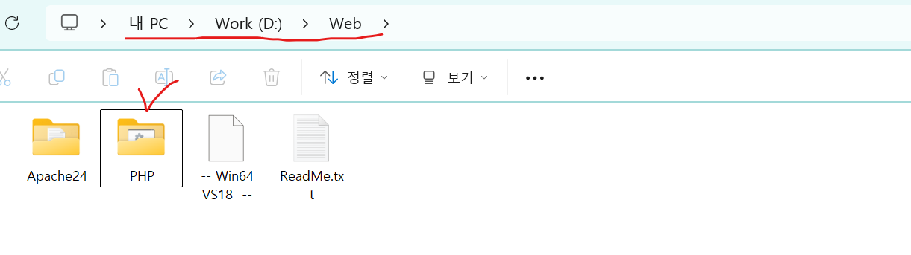

```text

```
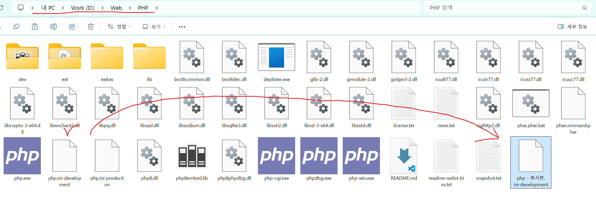

```text

```

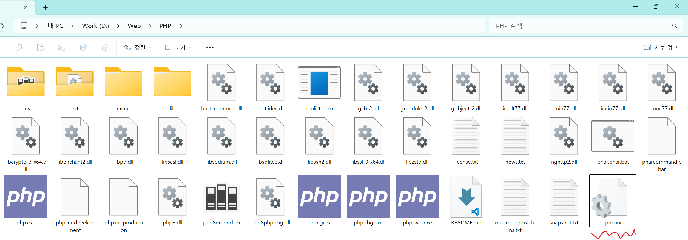

```text

```

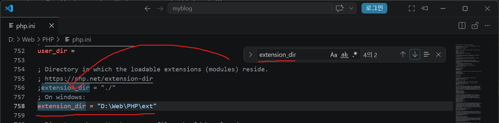
```
;extension_dir = "ext" 으로 되어있는 걸 extension_dir = "D:\Web\PHP\ext" 로 수정
```
### 환경변수 설정
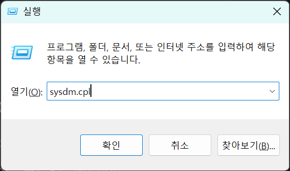
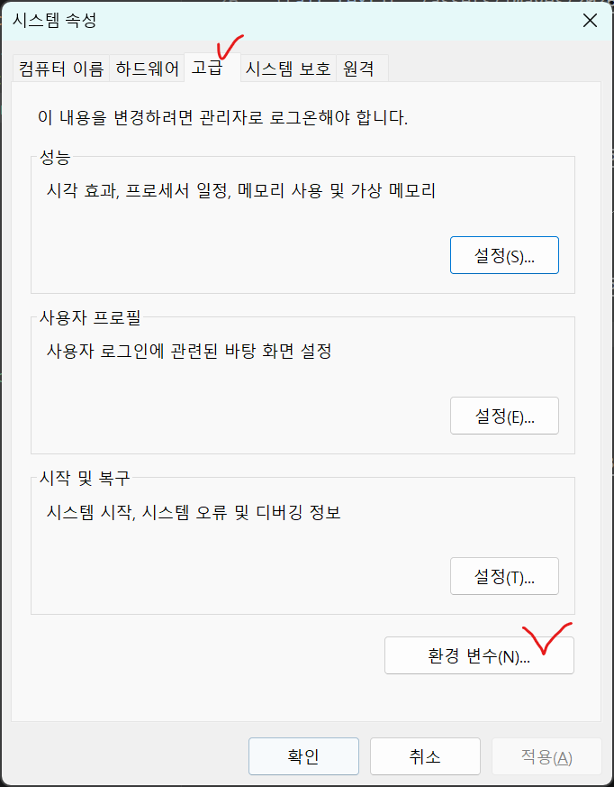
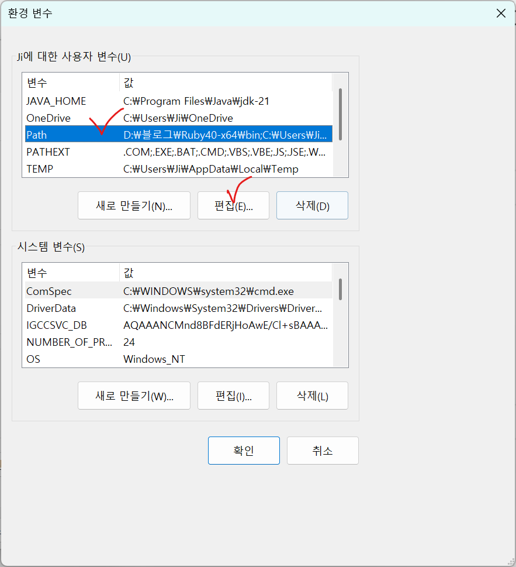
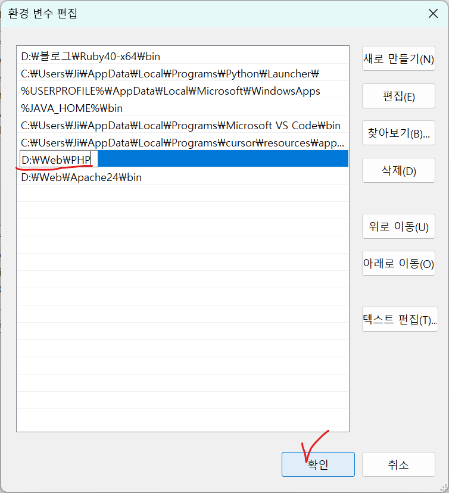
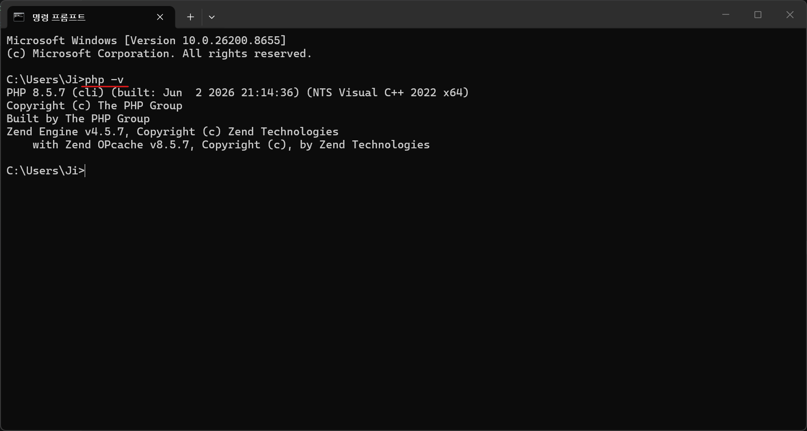


### 
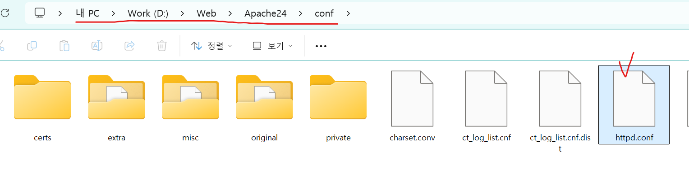


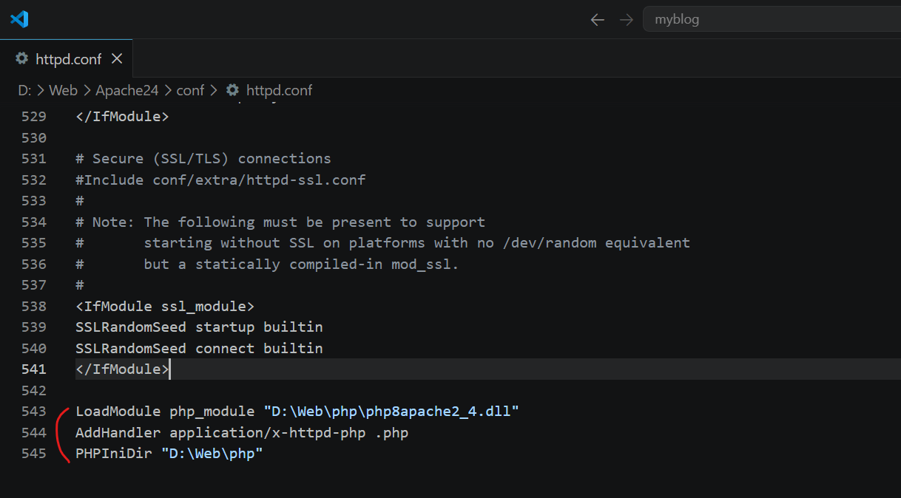

! php 파일에 "php8apache2_4.dll" 파일이 없으신가요?
아마 Non Thread Safe 파일을 받으셔서 그렇습니다.
정상적으로 Thread Safe 받으시면 해결 됩니다.

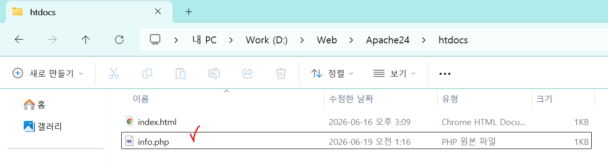
파일 만들기 info.php

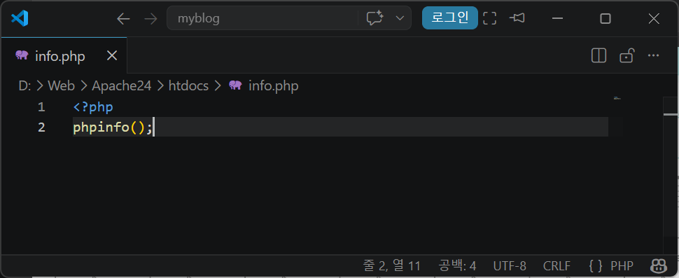
간단하게 php 반응 살펴보기

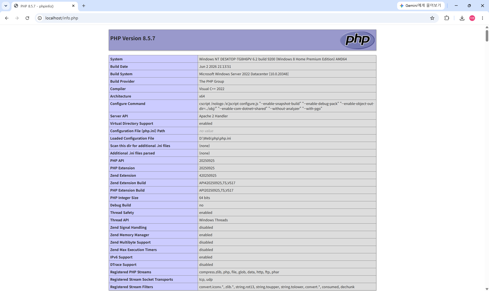
정상적으로 들어가는 모습

출처 : https://wikidocs.net/271931CD