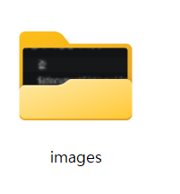

--- 
layout: post 
title: "2026-08-07 이미지 추가 시 경로 자동화" 
categories: [Blog] 
tags: [Blog, image] 
--- 
 
# 이미지 추가 시 경로 자동화 


 
### 문제 : 이미지 캡처하기
- 이미지 붙일 때 markdown폴더에 자동 생성되는 것이 편해서 이용
- 하지만 단순 복붙에 마크 다운과 같이 생성됨
- 자동화 할 수 있다면 생산성이 증가가 기대됨

### 해결 1 : markdown.copyFiles.destination
[markdown.copyFiles.destination 이란?](https://code.visualstudio.com/updates/v1_79#_markdowncopyfilesdestination)
```
이 markdown.copyFiles.destination설정은 새 미디어 파일이 생성되는 위치를 제어합니다.
```

<kbd>Ctrl</kbd> + <kbd>,</kbd> 으로 설정 창 열기
markdown.copyfile.destination 검색

```json
Markdown › Copy Files: Destination
복사/붙여넣기 또는 끌어서 놓기로 만든 파일의 경로와 파일 이름을 설정합니다. 새 파일을 만들어야 하는 대상 경로에 대한 Markdown 문서 경로와 일치하는 GLOB 맵입니다.

대상 경로는 다음 변수를 사용할 수 있습니다.

'${documentDirName}' — Markdown 문서의 절대 부모 디렉터리 경로입니다(예: '/Users/me/myProject/docs').
'${documentRelativeDirName}' — Markdown 문서의 상대 부모 디렉터리 경로입니다(예: 'docs'). 파일이 작업 영역의 일부가 아닌 경우 '${documentDirName}'과(와) 동일합니다.
'${documentFileName}' — Markdown 문서의 전체 파일 이름입니다(예: 'README.md').
'${documentBaseName}' — Markdown 문서의 기본 이름입니다(예: 'README').
'${documentExtName}' — Markdown 문서의 확장입니다(예: 'md').
'${documentFilePath}' — Markdown 문서의 절대 경로입니다(예: '/Users/me/myProject/docs/README.md').
'${documentRelativeFilePath}' — Markdown 문서의 상대 경로입니다(예: 'docs/README.md'). 파일이 작업 영역의 일부가 아닌 경우 '${documentFilePath}'과(와) 동일합니다.
'${documentWorkspaceFolder}' — Markdown 문서의 작업 영역 폴더입니다(예: '/Users/me/myProject'). 파일이 작업 영역의 일부가 아닌 경우 '${documentDirName}'과(와) 동일합니다.
'${fileName}' — 삭제된 파일의 파일 이름입니다(예: 'image.png').
'${fileExtName}' — 삭제된 파일의 확장명입니다(예: 'png').
'${unixTime}' - 현재 Unix 타임스탬프입니다(밀리초 단위).
'${isoTime}' — ISO 8601 형식의 현재 시간입니다(예: '2025-06-06T08:40:32.123Z').
```
<kbd>ctrl</kbd> + <kbd>shfit</kbd>  + <kbd>p</kbd>
open user settting 검색 후 json에서 markdown.copyFiles.destination 변경할 수 있다.
```json
"markdown.copyFiles.destination": {
        "/*": "/images/"
}
```
```text
post ┬ (현재마크다운).md
     └ images
        └ (캡처한이미지).png
```
값을 입력 후 캡처를 하면 해당 마크다운 파일에 이미지가 생성된다.



클립보드로 복사 후 붙여놓기를 하면
images 폴더가 생서되고 image.png가 생성된다.


### 문제 : 캡처한 이미지 MD 마다 관리
- 해당 이미지가 어디서 나왔는지에 대한 관리 필요


### 해결 1 : images 폴더 안에 마크다운 이름 폴더 추가

```json
"markdown.copyFiles.destination": {
    "/*": "/images/${documentBaseName}/"
}
```

```text
post ┬(현재마크다운).md
     └images
        └(현재의마크다운의 이름을 가진 폴더)
             └(캡처한이미지).png
```

### 해결 2 : images 폴더 안에 미크다운 이름으로 추가
```json
"markdown.copyFiles.destination": {
    "/*": "/images/${documentBaseName}.png"
}
```
```text
post ┬(현재마크다운).md
     └images
        └(현재의마크다운의 이름을 가진 이미지).png
```
[!WARNING] 오직 캡처할 때만 사용가능하다. pdf파일을 넣거나 jpg이미지를 넣을땐 확장자를 직접 수정해야함

### 트러블 슈팅 : 붙여놓을 파일 확장자를 가져오는 방법은 없는가?
```text
${fileExtName} : 파일 확장자 가져오기
```
```json
"markdown.copyFiles.destination": {
    "/*": "/images/${documentBaseName}.${fileExtName}"
}
```
```text
post ┬(현재마크다운).md
     └images
        └(현재의마크다운의 이름을 가진 이미지).(확장자 이름)
```

### 마무리 결과
1. 이미지 파일 캡처 후 붙여놓기
2. images 폴더가 생성되고 그 안에 작업하고 있는 마크다운 이름을 가진 이미지가 생성 

### 추가적으로..
- ${fileExtName}을 이용한다면 images 폴더 뿐만 아니라 확장자에 따른 폴더 정리도 가능할 것으로 보여진다.

예시
```json
"markdown.copyFiles.destination": {
    "/*": "/${fileExtName}/${documentBaseName}.${fileExtName}"
}
```
```text
post ┬(현재마크다운).md
     ├png 폴더
     │      └(현재의마크다운의 이름을 가진 이미지).png
     │
     ├pdf 폴더
     │      └(현재의마크다운의 이름을 가진 pdf파일).pdf
     │
     └jpg 폴더
            └(현재의마크다운의 이름을 가진 jpg 이미지).jpg
```

_post-(현재마크다운).md


     ├png 폴더
     │      └(현재의마크다운의 이름을 가진 이미지).png
     │
     ├pdf 폴더
     │      └(현재의마크다운의 이름을 가진 pdf파일).pdf
     │
     └jpg 폴더
            └(현재의마크다운의 이름을 가진 jpg 이미지).jpg


            