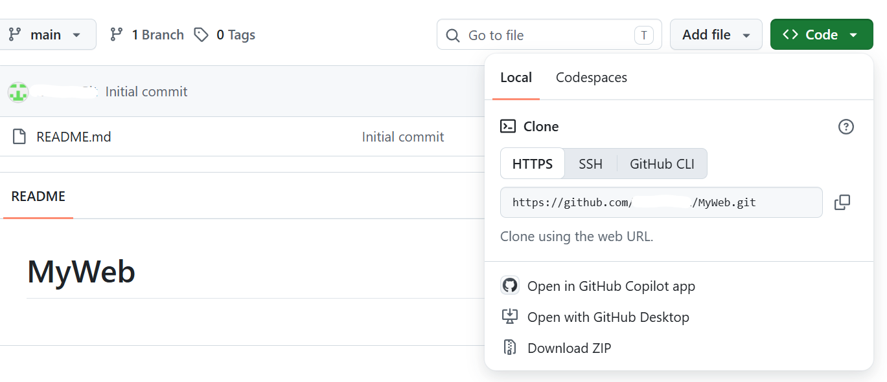

--- 
layout: post 
title: "2026-08-13 [APM구현]APM-github에-저장하기" 
categories: [WebDev] 
tags: [Apach, php, mySQL, github] 
--- 
 
# [APM구현]APM-github에-저장하기 
 
### github에 연결될 파일 구분
```text
─┬apach
 ├PHP
 ├mysql
 └htdocs * git에 연결될 파일
```
apach 안에 htdocs 파일을 복사하여 밖으로 빼준다.
### apach경로 재설정
```conf
DocumentRoot "(htdocs 해당 파일의 부모 절대경로)\htdocs"
```
htdocs 해당 파일의 절대 경로를 설정해 줘야한다. (밑에 Directory도 설정해주기)

<span style="color: red">DocumentRoot는 절대 경로만 사용할 수 있다.</span>
<span style="color: red">\\(역슬래시) 대신 /(슬래시)를 써야한다.</span> 

### 확인하기
```cmd
httpd -k start
```

### 로컬저장소 등록
htdocs 경로 창에 cmd입력
```cmd
git init
```

### 원격 저장소 등록
github 사이트에서 생성
설정 - private

### 로컬 저장소 원격 저장소 연결



저장소의 https 붙여놓고 연결하기
```cmd
git remote add origin (복사한 https)
```
확인하기
```cmd
git remote -v
```

로컬 저장소 원격 저장소에 올리기
```cmd
git fetch origin
git checkout main
git add .
git commit -m "첫 페이지"
git push
```

### 마무리
브라우저에 보이는 파일(htdocs)들은 다른 컴퓨터로 가져와 바로 사용할 수 있지만 apach의 설정들은 각 컴퓨터마다 설정해야 사용할 수 있다는 걸 깨달았다.
